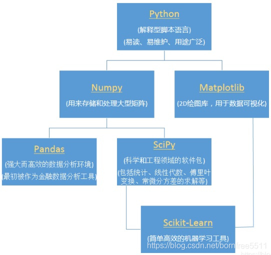

# Data Science

## 教程列表

| Notebook     |      Description      |   |
|:----------|:-------------|------:|
| [03_data_science/01_Numpy数组.ipynb](https://github.com/shibing624/python-tutorial/blob/master/03_data_science/01_Numpy数组.ipynb)  | Numpy array数组  | |
| [03_data_science/02_Numpy索引.ipynb](https://github.com/shibing624/python-tutorial/blob/master/03_data_science/02_Numpy索引.ipynb)  | Numpy index索引  | |
| [03_data_science/03_Numpy方法.ipynb](https://github.com/shibing624/python-tutorial/blob/master/03_data_science/03_Numpy方法.ipynb)  | Numpy 方法  | |
| [03_data_science/04_Matpoltlib画图.ipynb](https://github.com/shibing624/python-tutorial/blob/master/03_data_science/04_Matpoltlib画图.ipynb)  | Matpoltlib画图  | |
| [03_data_science/05_SciPy统计分布.ipynb](https://github.com/shibing624/python-tutorial/blob/master/03_data_science/05_SciPy统计分布.ipynb)  | Scipy统计分布  | |
| [03_data_science/06_SciPy曲线拟合.ipynb](https://github.com/shibing624/python-tutorial/blob/master/03_data_science/06_SciPy曲线拟合.ipynb)  | Scipy曲线  | |
| [03_data_science/07_Pandas数据类型.ipynb](https://github.com/shibing624/python-tutorial/blob/master/03_data_science/07_Pandas数据类型.ipynb)  | Pandas数据类型  | |
| [03_data_science/08_Pandas数据操作.ipynb](https://github.com/shibing624/python-tutorial/blob/master/03_data_science/08_Pandas数据操作.ipynb)  | Pandas操作  | |
| [03_data_science/09_Scikit-Learn分类.ipynb](https://github.com/shibing624/python-tutorial/blob/master/03_data_science/09_Scikit-Learn分类.ipynb)  | Scikit-Learn数据分类  | |
| [03_data_science/10_Scikit-Learn聚类.ipynb](https://github.com/shibing624/python-tutorial/blob/master/03_data_science/10_Scikit-Learn聚类.ipynb)  | Scikit-Learn聚类  | |

## 科学计算库
常用数据科学库之间的关系：

