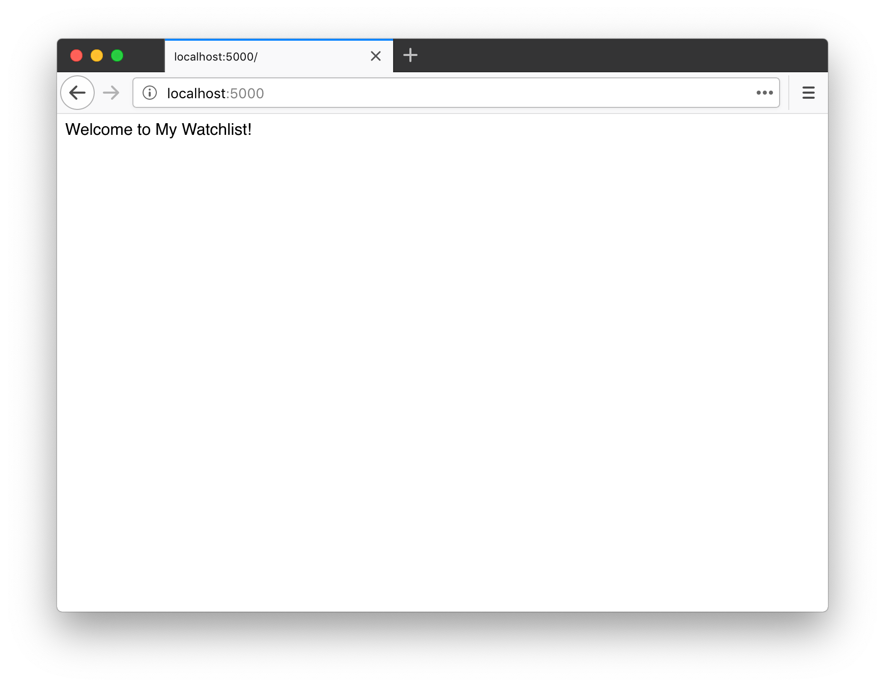
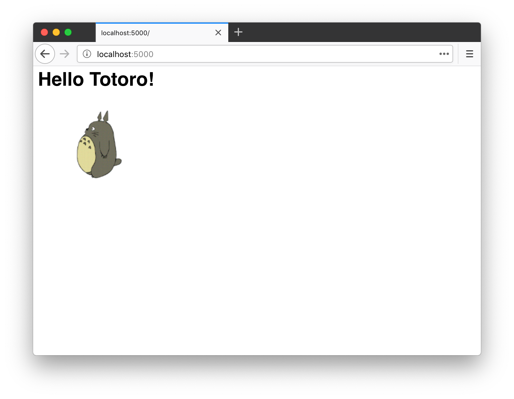

# 第 1 章：Hello, Flask!

追溯到最初，Flask 诞生于 Armin Ronacher 在 2010 年愚人节开的一个玩笑。后来，它逐渐发展成为一个成熟的 Python Web 框架，越来越受到开发者的喜爱。目前它在 GitHub 上是 Star 数量最多的 Python Web 框架，没有之一。

Flask 是典型的微框架，作为 Web 框架来说，它仅保留了核心功能：**请求响应处理**和**模板渲染**。这两类功能分别由 Werkzeug（WSGI 工具库）完成和 Jinja（模板渲染库）完成，因为 Flask 包装了这两个依赖，我们暂时不用深入了解它们。

## 主页

这一章的主要任务就是为我们的程序编写一个简单的主页。主页的 URL 一般就是根地址，即 `/`。当用户访问根地址的时候，我们需要返回一行欢迎文字。这个任务只需要下面几行代码就可以完成：

*app.py：程序主页*

```python
from flask import Flask
app = Flask(__name__)

@app.route('/')
def hello():
    return 'Welcome to My Watchlist!'
```

按照惯例，我们把程序保存为 app.py，确保当前目录是项目的根目录，并且激活了虚拟环境，然后在命令行窗口执行 `flask run` 命令启动程序（按下 Control + C 可以退出）：

```bash
(env) $ flask run
* Serving Flask app "app.py"
* Environment: production
  WARNING: Do not use the development server in a production environment.
  Use a production WSGI server instead.
* Debug mode: off
* Running on http://127.0.0.1:5000/ (Press CTRL+C to quit)
```

现在打开浏览器，访问 <http://localhost:5000> 即可访问我们的程序主页，并看到我们在程序里返回的问候语，如下图所示：



执行 `flask run` 命令时，Flask 会使用内置的开发服务器来运行程序。这个服务器默认监听本地机的 5000 端口，也就是说，我们可以通过在地址栏输入 <http://127.0.0.1:5000> 或是 <http://localhost:5000> 访问程序。

> **注意** 内置的开发服务器只能用于开发时使用，部署上线的时候要换用性能更好的服务器，我们会在最后一章学习。

## 代码解析

下面我们来分解这个 Flask 程序，了解它的基本构成。

首先我们从 `flask` 包导入 `Flask` 类，通过实例化这个类，创建一个程序对象 `app`：

```python
from flask import Flask
app = Flask(__name__)
```

接下来，我们要注册一个处理函数，这个函数是处理某个请求的处理函数，Flask 官方把它叫做视图函数（view funciton），你可以理解为“**请求处理函数**”。

所谓的“注册”，就是给这个函数戴上一个装饰器帽子。我们使用 `app.route()` 装饰器来为这个函数绑定对应的 URL，当用户在浏览器访问这个 URL 的时候，就会触发这个函数，获取返回值，并把返回值显示到浏览器窗口：

```python
@app.route('/')
def hello():
    return 'Welcome to My Watchlist!'
```

> **提示** 为了便于理解，你可以把 Web 程序看作是一堆这样的视图函数的集合：编写不同的函数处理对应 URL 的请求。

填入 `app.route()` 装饰器的第一个参数是 URL 规则字符串，这里的 `/`指的是根地址。

我们只需要写出相对地址，主机地址、端口号等都不需要写出。所以说，这里的 `/` 对应的是主机名后面的路径部分，完整 URL 就是 <http://localhost:5000/>。如果我们这里定义的 URL 规则是 `/hello`，那么完整 URL 就是 <http://localhost:5000/hello>。

整个请求的处理过程如下所示：

1. 当用户在浏览器地址栏访问这个地址，在这里即 <http://localhost:5000/>
2. 服务器解析请求，发现请求 URL 匹配的 URL 规则是 `/`，因此调用对应的处理函数 `hello()`
3. 获取 `hello()` 函数的返回值，处理后返回给客户端（浏览器）
4. 浏览器接受响应，将其显示在窗口上


## 实验时间

在这个小节，我们可以通过做一些实验，来扩展和加深对本节内容的理解。

### 修改视图函数返回值

首先，你可以自由修改视图函数的返回值，比如：

```python
@app.route('/')
def hello():
    return u'欢迎来到我的 Watchlist！'
```

返回值作为响应的主体，默认会被浏览器作为 HTML 格式解析，所以我们可以添加一个 HTML 元素标记：

```python
@app.route('/')
def hello():
    return '<h1>Hello Totoro!</h1>'
```

保存修改后，只需要在浏览器里刷新页面，你就会看到页面上的内容也会随之变化。



### 修改 URL 规则

另外，你也可以自由修改传入 `app.route` 装饰器里的 URL 规则字符串，但要注意以斜线 `/` 作为开头。比如：

```python
@app.route('/home')
def hello():
    return 'Welcome to My Watchlist!'
```

保存修改，这时刷新浏览器，则会看到一个 404 错误提示，提示页面未找到（Page Not Found）。这是因为视图函数的 URL 改成了 `/home`，而我们刷新后访问的地址仍然是旧的 `/`。如果我们把访问地址改成 <http://localhost:5000/home>，就会正确看到返回值。

一个视图函数也可以绑定多个 URL，这通过附加多个装饰器实现，比如：

```python
@app.route('/')
@app.route('/index')
@app.route('/home')
def hello():
    return 'Welcome to My Watchlist!'
```

现在无论是访问 <http://localhost:5000/>、<http://localhost:5000/home> 还是 <http://localhost:5000/index> 都可以看到返回值。

在前面，我们之所以把传入 `app.route` 装饰器的参数称为 URL 规则，是因为我们也可以在 URL 里定义变量部分。比如下面这个视图函数会处理所有类似 `/user/<name>` 的请求：

```python
@app.route('/user/<name>')
def user_page(name):
    return 'User page'
```

不论你访问 <http://localhost:5000/user/greyli>，还是 <http://localhost:5000/user/peter>，抑或是 <http://localhost:5000/user/甲>，都会触发这个函数。通过下面的方式，我们也可以在视图函数里获取到这个变量值：

```python
from flask import escape

@app.route('/user/<name>')
def user_page(name):
    return 'User: %s' % escape(name)
```

> **注意** 用户输入的数据会包含恶意代码，所以不能直接作为响应返回，需要使用 Flask 提供的 escape() 函数对 name 变量进行转义处理，比如把 `<` 转换成 `&lt;`。这样在返回响应时浏览器就不会把它们当做代码执行。

### 修改视图函数名？

最后一个可以修改的部分就是视图函数的名称了。首先，视图函数的名字是自由定义的，和 URL 规则无关。和定义其他函数或变量一样，只需要让它表达出所要处理页面的含义即可。

除此之外，它还有一个重要的作用：作为代表某个路由的端点（endpoint），同时用来生成 URL。对于程序内的 URL，为了避免手写，Flask 提供了一个 `url_for` 函数来生成 URL，它接受的第一个参数就是端点值，默认为视图函数的名称：

```python
from flask import url_for, escape

# ...

@app.route('/')
def hello():
    return 'Hello'

@app.route('/user/<name>')
def user_page(name):
    return 'User: %s' % escape(name)

@app.route('/test')
def test_url_for():
    # 下面是一些调用示例（请在命令行窗口查看输出的 URL）：
    print(url_for('hello'))  # 输出：/
    # 注意下面两个调用是如何生成包含 URL 变量的 URL 的
    print(url_for('user_page', name='greyli'))  # 输出：/user/greyli
    print(url_for('user_page', name='peter'))  # 输出：/user/peter
    print(url_for('test_url_for'))  # 输出：/test
    # 下面这个调用传入了多余的关键字参数，它们会被作为查询字符串附加到 URL 后面。
    print(url_for('test_url_for', num=2))  # 输出：/test?num=2
    return 'Test page'
```

实验过程中编写的代码可以删掉，也可以保留，但记得为根地址返回一行问候，这可是我们这一章的任务。
