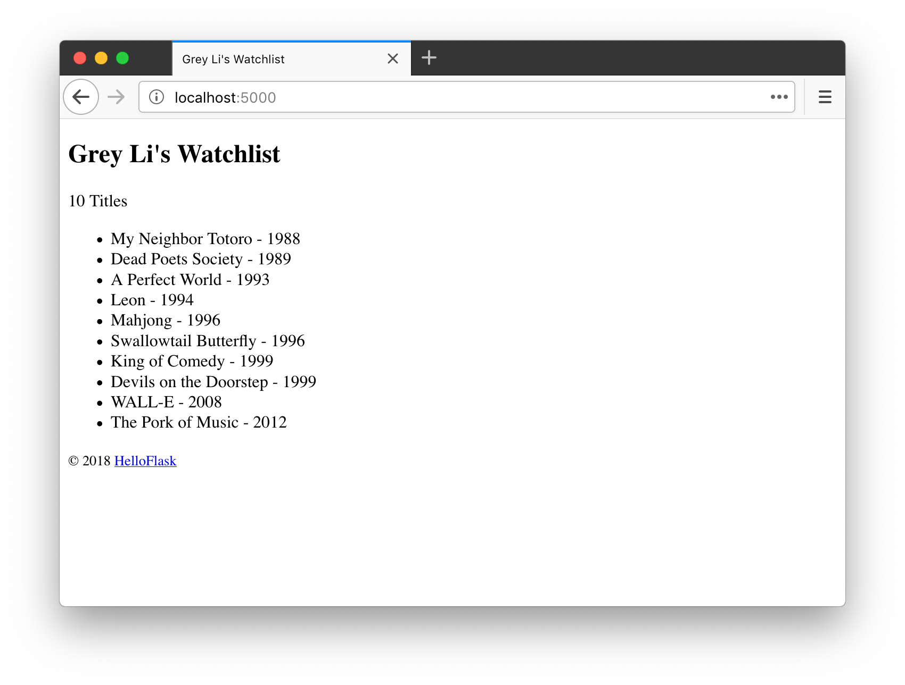

# 第 2 章：模板

在一般的 Web 程序里，访问一个地址通常会返回一个包含各类信息的 HTML 页面。因为我们的程序是动态的，页面中的某些信息需要根据不同的情况来进行调整，比如对登录和未登录用户显示不同的信息，所以页面需要在用户访问时根据程序逻辑动态生成。

我们把包含变量和运算逻辑的 HTML 或其他格式的文本叫做**模板**，执行这些变量替换和逻辑计算工作的过程被称为**渲染**，这个工作由我们这一章要学习使用的模板渲染引擎——Jinja2 来完成。

按照默认的设置，Flask 会从程序实例所在模块同级目录的 templates 文件夹中寻找模板，我们的程序目前存储在项目根目录的 app.py 文件里，所以我们要在项目根目录创建这个文件夹：

```bash
$ mkdir templates
```

## 模板基本语法

在社交网站上，每个人都有一个主页，借助 Jinja2 就可以写出一个通用的模板。

Jinja2 的语法和 Python 大致相同，你在后面会陆续接触到一些常见的用法。在模板里，你需要添加特定的定界符将 Jinja2 语句和变量标记出来，下面是三种常用的定界符：

- `{{ ... }}` 用来标记变量。
- `` 用来标记语句，比如 if 语句，for 语句等。
- `{# ... #}` 用来写注释。

模板中使用的变量需要在渲染的时候传递进去，具体我们后面会了解。

## 编写主页模板

我们先在 templates 目录下创建一个 index.html 文件，作为主页模板。主页需要显示电影条目列表和个人信息，代码如下所示：

*templates/index.html：主页模板*

```jinja2
<!DOCTYPE html>
<html lang="en">
<head>
    <meta charset="utf-8">
    <title>{{ name }}'s Watchlist</title>
</head>
<body>
    <h2>{{ name }}'s Watchlist</h2>
    {# 使用 length 过滤器获取 movies 变量的长度 #}
    <p>{{ movies|length }} Titles</p>
    <ul>
          {# 迭代 movies 变量 #}
        <li>{{ movie.title }} - {{ movie.year }}</li>  {# 等同于 movie['title'] #}
          {# 使用 endfor 标签结束 for 语句 #}
    </ul>
    <footer>
        <small>&copy; 2018 <a href="http://helloflask.com/tutorial">HelloFlask</a></small>
	</footer>
</body>
</html>
```

为了方便对变量进行处理，Jinja2 提供了一些过滤器，语法形式如下：

```jinja2
{{ 变量|过滤器 }}
```

左侧是变量，右侧是过滤器名。比如，上面的模板里使用 `length` 过滤器来获取 `movies` 的长度，类似 Python 里的 `len()` 函数。

> **提示** 访问 <http://jinja.pocoo.org/docs/2.10/templates/#list-of-builtin-filters> 查看所有可用的过滤器。

## 准备虚拟数据

为了模拟页面渲染，我们需要先创建一些虚拟数据，用来填充页面内容：

*app.py：定义虚拟数据*

```python
name = 'Grey Li'
movies = [
    {'title': 'My Neighbor Totoro', 'year': '1988'},
    {'title': 'Dead Poets Society', 'year': '1989'},
    {'title': 'A Perfect World', 'year': '1993'},
    {'title': 'Leon', 'year': '1994'},
    {'title': 'Mahjong', 'year': '1996'},
    {'title': 'Swallowtail Butterfly', 'year': '1996'},
    {'title': 'King of Comedy', 'year': '1999'},
    {'title': 'Devils on the Doorstep', 'year': '1999'},
    {'title': 'WALL-E', 'year': '2008'},
    {'title': 'The Pork of Music', 'year': '2012'},
]
```

## 渲染主页模板

使用 `render_template()` 函数可以把模板渲染出来，必须传入的参数为模板文件名（相对于 templates 根目录的文件路径），这里即 `'index.html'`。为了让模板正确渲染，我们还要把模板内部使用的变量通过关键字参数传入这个函数，如下所示：

*app.py：返回渲染好的模板作为响应*

```python
from flask import Flask, render_template

# ...

@app.route('/')
def index():
    return render_template('index.html', name=name, movies=movies)
```

为了更好的表示这个视图函数的作用，我们把原来的函数名 `hello` 改为 `index`，意思是“索引”，即主页。

在传入 `render_template()` 函数的关键字参数中，左边的 `movies` 是模板中使用的变量名称，右边的 `movies` 则是该变量指向的实际对象。这里传入模板的 `name` 是字符串，`movies` 是列表，但能够在模板里使用的不只这两种 Python 数据结构，你也可以传入元组、字典、函数等。

`render_template()` 函数在调用时会识别并执行 index.html 里所有的 Jinja2 语句，返回渲染好的模板内容。在返回的页面中，变量会被替换为实际的值（包括定界符），语句（及定界符）则会在执行后被移除（注释也会一并移除）。

现在访问 <http://localhost:5000/> 看到的程序主页如下图所示：


