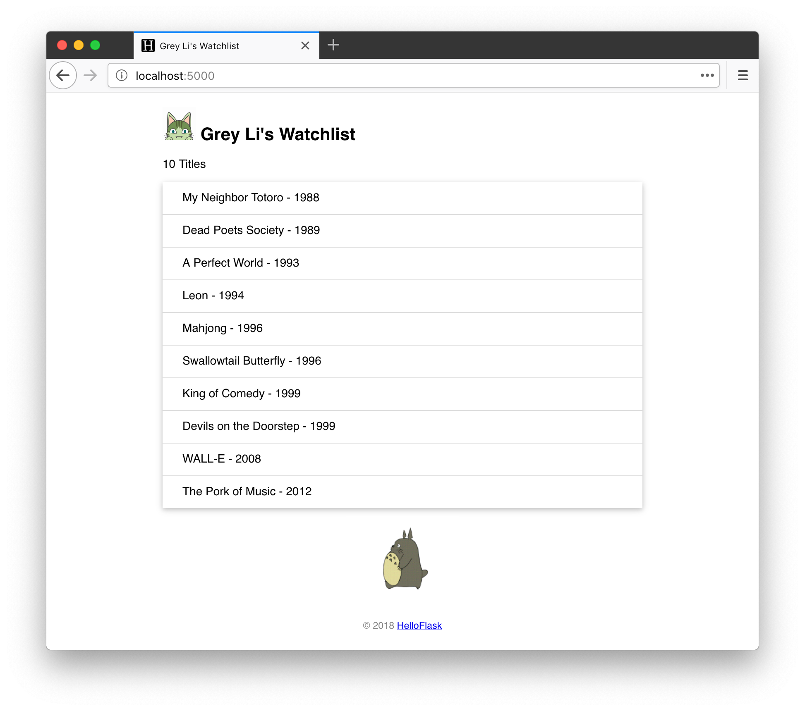

# 第 3 章：静态文件

静态文件（static files）和我们的模板概念相反，指的是内容不需要动态生成的文件。比如图片、CSS 文件和 JavaScript 脚本等。

在 Flask 中，我们需要创建一个 static 文件夹来保存静态文件，它应该和程序模块、templates 文件夹在同一目录层级，所以我们在项目根目录创建它：

```bash
$ mkdir static
```

## 生成静态文件 URL

在 HTML 文件里，引入这些静态文件需要给出资源所在的 URL。为了更加灵活，这些文件的 URL 可以通过 Flask 提供的 `url_for()` 函数来生成。

在第 2 章的最后，我们学习过 `url_for()` 函数的用法，传入端点值（视图函数的名称）和参数，它会返回对应的 URL。对于静态文件，需要传入的端点值是 `static`，同时使用 `filename` 参数来传入相对于 static 文件夹的文件路径。

假如我们在 static 文件夹的根目录下面放了一个 foo.jpg 文件，下面的调用可以获取它的 URL：

```jinja2

```

花括号部分的调用会返回 `/static/foo.jpg`。

> **提示** 在 Python 脚本里，`url_for()` 函数需要从 `flask` 包中导入，而在模板中则可以直接使用，因为 Flask 把一些常用的函数和对象添加到了模板上下文（环境）里。

## 添加 Favicon

Favicon（favourite icon） 是显示在标签页和书签栏的网站头像。你需要准备一个 ICO、PNG 或 GIF 格式的图片，大小一般为 16×16、32×32、48×48 或 64×64 像素。把这个图片放到 static 目录下，然后像下面这样在 HTML 模板里引入它：

*templates/index.html：引入 Favicon*

```html
<head>
    ...
    <link rel="icon" href="{{ url_for('static', filename='favicon.ico') }}">
</head>
```

保存后刷新页面，即可在浏览器标签页上看到这个图片。

## 添加图片

为了让页面不那么单调，我们来添加两个图片：一个是显示在页面标题旁边的头像，另一个是显示在页面底部的龙猫动图。我们在 static 目录下面创建一个子文件夹 images，把这两个图片都放到这个文件夹里：

```bash
$ cd static
$ mkdir images
```

创建子文件夹并不是必须的，这里只是为了更好的组织同类文件。同样的，如果你有多个 CSS 文件，也可以创建一个 css 文件夹来组织他们。下面我们在页面模板中添加这两个图片，注意填写正确的文件路径：

*templates/index.html：添加图片*

```html
<h2>
    
    {{ name }}'s Watchlist
</h2>
...

```

> **提示** 这两张图片你可以自己替换为任意的图片（注意更新文件名），也可以在示例程序的 [GitHub 仓库](https://github.com/greyli/watchlist/tree/master/watchlist/static/images)下载。

## 添加 CSS

虽然添加了图片，但页面还是非常简陋，因为我们还没有添加 CSS 定义。下面在 static 目录下创建一个 CSS 文件 style.css，内容如下：

*static/style.css：定义页面样式*

```css
/* 页面整体 */
body {
    margin: auto;
    max-width: 580px;
    font-size: 14px;
    font-family: Helvetica, Arial, sans-serif;
}

/* 页脚 */
footer {
    color: #888;
    margin-top: 15px;
    text-align: center;
    padding: 10px;
}

/* 头像 */
.avatar {
    width: 40px;
}

/* 电影列表 */
.movie-list {
    list-style-type: none;
    padding: 0;
    margin-bottom: 10px;
    box-shadow: 0 2px 5px 0 rgba(0, 0, 0, 0.16), 0 2px 10px 0 rgba(0, 0, 0, 0.12);
}

.movie-list li {
    padding: 12px 24px;
    border-bottom: 1px solid #ddd;
}

.movie-list li:last-child {
    border-bottom:none;
}

.movie-list li:hover {
    background-color: #f8f9fa;
}

/* 龙猫图片 */
.totoro {
    display: block;
    margin: 0 auto;
    height: 100px;
}
```

接着在页面的 `<head>` 标签内引入这个 CSS 文件：

*templates/index.html：引入 CSS 文件*

```html
<head>
    ...
    <link rel="stylesheet" href="{{ url_for('static', filename='style.css') }}" type="text/css">
</head>
```

> **提示** 当你把 CSS 写到单独的文件后，浏览器获取到这个文件后会对其进行缓存（其他静态文件同理，比如 JavaScript 文件）。所以，在后续章节，每当你对 CSS 文件的内容进行更新后，都需要使用下面的快捷键清除缓存：
>
> - Google Chrome（Mac）：Command + Shift + R
> - Google Chrome（Windows & Linux）：Ctrl + F5
> - Firefox（Mac）：Command + Shift + R
> - Firefox（Windows & Linux）：Ctrl + F5
> - Safari：Command + Option + R

最后要为对应的元素设置 `class` 属性值，以便和对应的 CSS 定义关联起来：

*templates/index.html：添加 class 属性*

```html
<h2>
    
    {{ name }}'s Watchlist
</h2>
...
<ul class="movie-list">
    ...
</ul>

```

最终的页面如下图所示（你可以自由修改 CSS 定义，我已经尽力了）：


