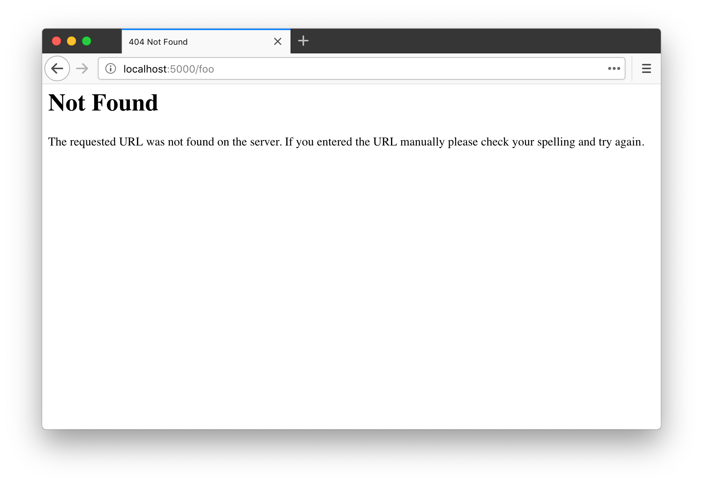
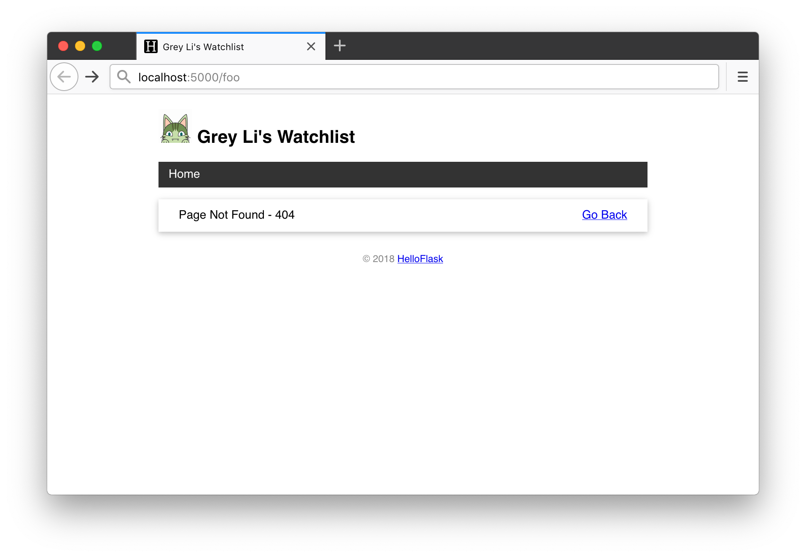
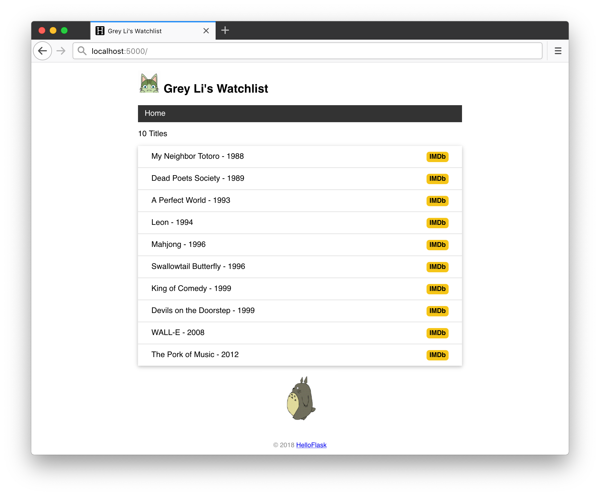

# 第 5 章：模板优化

这一章我们会继续完善模板，学习几个非常实用的模板编写技巧，为下一章实现创建、编辑电影条目打下基础。

## 自定义错误页面

为了引出相关知识点，我们首先要为 Watchlist 编写一个错误页面。目前的程序中，如果你访问一个不存在的 URL，比如 /hello，Flask 会自动返回一个 404 错误响应。默认的错误页面非常简陋，如下图所示：



在 Flask 程序中自定义错误页面非常简单，我们先编写一个 404 错误页面模板，如下所示：

*templates/404.html：404 错误页面模板*

```html
<!DOCTYPE html>
<html lang="en">
<head>
    <meta charset="utf-8">
    <title>{{ user.name }}'s Watchlist</title>
    <link rel="icon" href="{{ url_for('static', filename='favicon.ico') }}">
    <link rel="stylesheet" href="{{ url_for('static', filename='style.css') }}" type="text/css">
</head>
<body>
    <h2>
        
        {{ user.name }}'s Watchlist
    </h2>
    <ul class="movie-list">
        <li>
            Page Not Found - 404
            <span class="float-right">
                <a href="{{ url_for('index') }}">Go Back</a>
            </span>
        </li>
    </ul>
    <footer>
        <small>&copy; 2018 <a href="http://helloflask.com/tutorial">HelloFlask</a></small>
	</footer>
</body>
</html>
```

接着使用 `app.errorhandler()` 装饰器注册一个错误处理函数，它的作用和视图函数类似，当 404 错误发生时，这个函数会被触发，返回值会作为响应主体返回给客户端：

*app.py：404 错误处理函数*

```python
@app.errorhandler(404)  # 传入要处理的错误代码
def page_not_found(e):  # 接受异常对象作为参数
    user = User.query.first()
    return render_template('404.html', user=user), 404  # 返回模板和状态码
```

> **提示** 和我们前面编写的视图函数相比，这个函数返回了状态码作为第二个参数，普通的视图函数之所以不用写出状态码，是因为默认会使用 200 状态码，表示成功。

这个视图返回渲染好的错误模板，因为模板中使用了 user 变量，这里也要一并传入。现在访问一个不存在的 URL，会显示我们自定义的错误页面：



编写完这部分代码后，你会发现两个问题：

* 错误页面和主页都需要使用 user 变量，所以在对应的处理函数里都要查询数据库并传入 user 变量。因为每一个页面都需要获取用户名显示在页面顶部，如果有更多的页面，那么每一个对应的视图函数都要重复传入这个变量。
* 错误页面模板和主页模板有大量重复的代码，比如 `<head>` 标签的内容，页首的标题，页脚信息等。这种重复不仅带来不必要的工作量，而且会让修改变得更加麻烦。举例来说，如果页脚信息需要更新，那么每个页面都要一一进行修改。

显而易见，这两个问题有更优雅的处理方法，下面我们来一一了解。

## 模板上下文处理函数

对于多个模板内都需要使用的变量，我们可以使用 `app.context_processor` 装饰器注册一个模板上下文处理函数，如下所示：

*app.py：模板上下文处理函数*

```python
@app.context_processor
def inject_user():  # 函数名可以随意修改
    user = User.query.first()
    return dict(user=user)  # 需要返回字典，等同于 return {'user': user}
```

这个函数返回的变量（以字典键值对的形式）将会统一注入到每一个模板的上下文环境中，因此可以直接在模板中使用。

现在我们可以删除 404 错误处理函数和主页视图函数中的 `user` 变量定义，并删除在 `render_template()` 函数里传入的关键字参数：

```python
@app.context_processor
def inject_user():
    user = User.query.first()
    return dict(user=user)


@app.errorhandler(404)
def page_not_found(e):
    return render_template('404.html'), 404


@app.route('/')
def index():
    movies = Movie.query.all()
    return render_template('index.html', movies=movies)
```

同样的，后面我们创建的任意一个模板，都可以在模板中直接使用 `user` 变量。

## 使用模板继承组织模板

对于模板内容重复的问题，Jinja2 提供了模板继承的支持。这个机制和 Python 类继承非常类似：我们可以定义一个父模板，一般会称之为基模板（base template）。基模板中包含完整的 HTML 结构和导航栏、页首、页脚等通用部分。在子模板里，我们可以使用 `extends` 标签来声明继承自某个基模板。

基模板中需要在实际的子模板中追加或重写的部分则可以定义成块（block）。块使用 `block` 标签创建， `` 作为开始标记，`` 或 `` 作为结束标记。通过在子模板里定义一个同样名称的块，你可以向基模板的对应块位置追加或重写内容。

### 编写基础模板

下面是新编写的基模板 base.html：

*templates/base.html：基模板*

```html
<!DOCTYPE html>
<html lang="en">
<head>
    
    <meta charset="utf-8">
    <meta name="viewport" content="width=device-width, initial-scale=1.0">
    <title>{{ user.name }}'s Watchlist</title>
    <link rel="icon" href="{{ url_for('static', filename='favicon.ico') }}">
    <link rel="stylesheet" href="{{ url_for('static', filename='style.css') }}" type="text/css">
    
</head>
<body>
    <h2>
        
        {{ user.name }}'s Watchlist
    </h2>
    <nav>
        <ul>
            <li><a href="{{ url_for('index') }}">Home</a></li>
        </ul>
    </nav>
    
    <footer>
        <small>&copy; 2018 <a href="http://helloflask.com/tutorial">HelloFlask</a></small>
	</footer>
</body>
</html>
```

在基模板里，我们添加了两个块，一个是包含 `<head></head>` 内容的 `head` 块，另一个是用来在子模板中插入页面主体内容的 `content` 块。在复杂的项目里，你可以定义更多的块，方便在子模板中对基模板的各个部分插入内容。另外，块的名字没有特定要求，你可以自由修改。

在编写子模板之前，我们先来看一下基模板中的两处新变化。

第一处，我们添加了一个新的 `<meta>` 元素，这个元素会设置页面的视口，让页面根据设备的宽度来自动缩放页面，让移动设备拥有更好的浏览体验：

```html
<meta name="viewport" content="width=device-width, initial-scale=1.0">
```

第二处，新的页面添加了一个导航栏：

```html
<nav>
    <ul>
        <li><a href="{{ url_for('index') }}">Home</a></li>
    </ul>
</nav>
```

导航栏对应的 CSS 代码如下所示：

```css
nav ul {
    list-style-type: none;
    margin: 0;
    padding: 0;
    overflow: hidden;
    background-color: #333;
}

nav li {
    float: left;
}

nav li a {
    display: block;
    color: white;
    text-align: center;
    padding: 8px 12px;
    text-decoration: none;
}

nav li a:hover {
    background-color: #111;
}
```

### 编写子模板

创建了基模板后，子模板的编写会变得非常简单。下面是新的主页模板（index.html）：

*templates/index.html：继承基模板的主页模板*

```html



<p>{{ movies|length }} Titles</p>
<ul class="movie-list">
    
    <li>{{ movie.title }} - {{ movie.year }}
        <span class="float-right">
            <a class="imdb" href="https://www.imdb.com/find?q={{ movie.title }}" target="_blank" title="Find this movie on IMDb">IMDb</a>
        </span>
    </li>
    
</ul>


```

第一行使用 `extends` 标签声明扩展自模板 base.html，可以理解成“这个模板继承自 base.html“。接着我们定义了 `content` 块，这里的内容会插入到基模板中 `content` 块的位置。

> **提示** 默认的块重写行为是覆盖，如果你想向父块里追加内容，可以在子块中使用 `super()` 声明，即 `{{ super() }}`。

404 错误页面的模板类似，如下所示：

*templates/404.html：继承基模板的 404 错误页面模板*

```html



<ul class="movie-list">
    <li>
        Page Not Found - 404
        <span class="float-right">
            <a href="{{ url_for('index') }}">Go Back</a>
        </span>
    </li>
</ul>

```

## 添加 IMDb 链接

在主页模板里，我们还为每一个电影条目右侧添加了一个 IMDb 链接：

```html
<span class="float-right">
    <a class="imdb" href="https://www.imdb.com/find?q={{ movie.title }}" target="_blank" title="Find this movie on IMDb">IMDb</a>
</span>
```

这个链接的 `href` 属性的值为 IMDb 搜索页面的 URL，搜索关键词通过查询参数 `q` 传入，这里传入了电影的标题。

对应的 CSS 定义如下所示：

```css
.float-right {
    float: right;
}

.imdb {
    font-size: 12px;
    font-weight: bold;
    color: black;
    text-decoration: none;
    background: #F5C518;
    border-radius: 5px;
    padding: 3px 5px;
}
```

现在，我们的程序主页如下所示：



