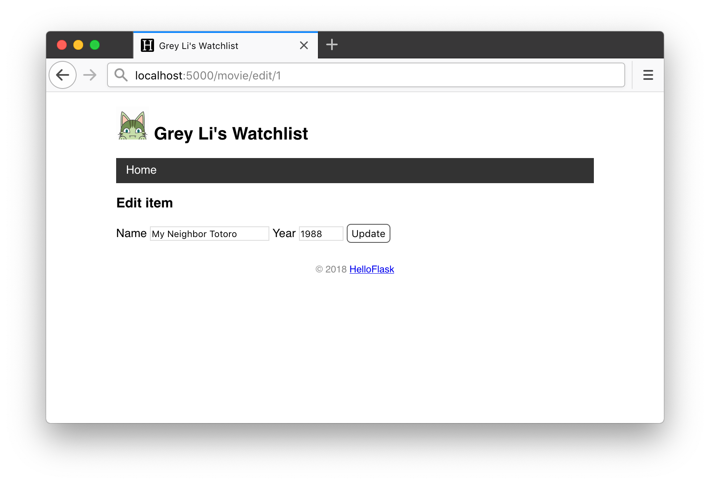
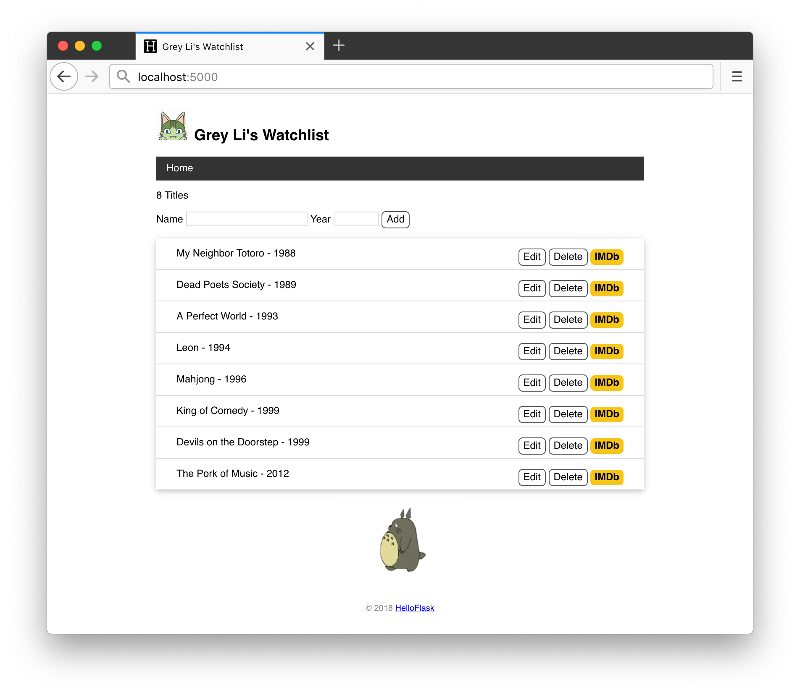

# 第 6 章：表单

在 HTML 页面里，我们需要编写表单来获取用户输入。一个典型的表单如下所示：

```html
<form method="post">  <!-- 指定提交方法为 POST -->
    <label for="name">名字</label>
    <input type="text" name="name" id="name"><br>  <!-- 文本输入框 -->
    <label for="occupation">职业</label>
    <input type="text" name="occupation" id="occupation"><br>  <!-- 文本输入框 -->
    <input type="submit" name="submit" value="登录">  <!-- 提交按钮 -->
</form>
```

编写表单的 HTML 代码有下面几点需要注意：

* 在 `<form>` 标签里使用 `method` 属性将提交表单数据的 HTTP 请求方法指定为 POST。如果不指定，则会默认使用 GET 方法，这会将表单数据通过 URL 提交，容易导致数据泄露，而且不适用于包含大量数据的情况。
* `<input>` 元素必须要指定 `name`  属性，否则无法提交数据，在服务器端，我们也需要通过这个 `name` 属性值来获取对应字段的数据。

> **提示** 填写输入框标签文字的 `<label>` 元素不是必须的，只是为了辅助鼠标用户。当使用鼠标点击标签文字时，会自动激活对应的输入框，这对复选框来说比较有用。`for` 属性填入要绑定的 `<input>` 元素的 `id` 属性值。

## 创建新条目

创建新条目可以放到一个新的页面来实现，也可以直接在主页实现。这里我们采用后者，首先在主页模板里添加一个表单：

*templates/index.html：添加创建新条目表单*

```html
<p>{{ movies|length }} Titles</p>
<form method="post">
    Name <input type="text" name="title" autocomplete="off" required>
    Year <input type="text" name="year" autocomplete="off" required>
    <input class="btn" type="submit" name="submit" value="Add">
</form>
```

在这两个输入字段中，`autocomplete` 属性设为 `off` 来关闭自动完成（按下输入框不显示历史输入记录）；另外还添加了 `required` 标志属性，如果用户没有输入内容就按下了提交按钮，浏览器会显示错误提示。

两个输入框和提交按钮相关的 CSS 定义如下：

```css
/* 覆盖某些浏览器对 input 元素定义的字体 */
input[type=submit] {
    font-family: inherit;
}

input[type=text] {
    border: 1px solid #ddd;
}

input[name=year] {
    width: 50px;
}

.btn {
    font-size: 12px;
    padding: 3px 5px;
    text-decoration: none;
    cursor: pointer;
    background-color: white;
    color: black;
    border: 1px solid #555555;
    border-radius: 5px;
}

.btn:hover {
    text-decoration: none;
    background-color: black;
    color: white;
    border: 1px solid black;
}
```

接下来，我们需要考虑如何获取提交的表单数据。

## 处理表单数据

默认情况下，当表单中的提交按钮被按下，浏览器会创建一个新的请求，默认发往当前 URL（在 `<form>` 元素使用 `action` 属性可以自定义目标 URL）。

因为我们在模板里为表单定义了 POST 方法，当你输入数据，按下提交按钮，一个携带输入信息的 POST 请求会发往根地址。接着，你会看到一个 405 Method Not Allowed 错误提示。这是因为处理根地址请求的 `index` 视图默认只接受 GET 请求。

> **提示** 在 HTTP 中，GET 和 POST 是两种最常见的请求方法，其中 GET 请求用来获取资源，而 POST 则用来创建 / 更新资源。我们访问一个链接时会发送 GET 请求，而提交表单通常会发送 POST 请求。

为了能够处理 POST 请求，我们需要修改一下视图函数：

```python
@app.route('/', methods=['GET', 'POST'])
```

在 `app.route()` 装饰器里，我们可以用 `methods` 关键字传递一个包含 HTTP 方法字符串的列表，表示这个视图函数处理哪种方法类型的请求。默认只接受 GET 请求，上面的写法表示同时接受 GET 和 POST 请求。

两种方法的请求有不同的处理逻辑：对于 GET 请求，返回渲染后的页面；对于 POST 请求，则获取提交的表单数据并保存。为了在函数内加以区分，我们添加一个 if 判断：

*app.py：创建电影条目*

```python
from flask import request, url_for, redirect, flash

# ...

@app.route('/', methods=['GET', 'POST'])
def index():
    if request.method == 'POST':  # 判断是否是 POST 请求
        # 获取表单数据
        title = request.form.get('title')  # 传入表单对应输入字段的 name 值
        year = request.form.get('year')
        # 验证数据
        if not title or not year or len(year) > 4 or len(title) > 60:
            flash('Invalid input.')  # 显示错误提示
            return redirect(url_for('index'))  # 重定向回主页
        # 保存表单数据到数据库
        movie = Movie(title=title, year=year)  # 创建记录
        db.session.add(movie)  # 添加到数据库会话
        db.session.commit()  # 提交数据库会话
        flash('Item created.')  # 显示成功创建的提示
        return redirect(url_for('index'))  # 重定向回主页

    movies = Movie.query.all()
    return render_template('index.html', movies=movies)
```

在 `if` 语句内，我们编写了处理表单数据的代码，其中涉及 3 个新的知识点，下面来一一了解。

### 请求对象

Flask 会在请求触发后把请求信息放到 `request` 对象里，你可以从 `flask` 包导入它：

```python
from flask import request
```

因为它在请求触发时才会包含数据，所以你只能在视图函数内部调用它。它包含请求相关的所有信息，比如请求的路径（`request.path`）、请求的方法（`request.method`）、表单数据（`request.form`）、查询字符串（`request.args`）等等。

在上面的 `if` 语句中，我们首先通过 `request.method` 的值来判断请求方法。在 `if` 语句内，我们通过 `request.form` 来获取表单数据。`request.form` 是一个特殊的字典，用表单字段的 `name` 属性值可以获取用户填入的对应数据：

```python
if request.method == 'POST':
    title = request.form.get('title')
    year = request.form.get('year')
```

### flash 消息

在用户执行某些动作后，我们通常在页面上显示一个提示消息。最简单的实现就是在视图函数里定义一个包含消息内容的变量，传入模板，然后在模板里渲染显示它。因为这个需求很常用，Flask 内置了相关的函数。其中 `flash()` 函数用来在视图函数里向模板传递提示消息，`get_flashed_messages()` 函数则用来在模板中获取提示消息。

`flash()` 的用法很简单，首先从 `flask` 包导入 `flash` 函数：

```python
from flask import flash
```

然后在视图函数里调用，传入要显示的消息内容：

```python
flash('Item Created.')
```

`flash()` 函数在内部会把消息存储到 Flask 提供的 `session` 对象里。`session` 用来在请求间存储数据，它会把数据签名后存储到浏览器的 Cookie 中，所以我们需要设置签名所需的密钥：

```python
app.config['SECRET_KEY'] = 'dev'  # 等同于 app.secret_key = 'dev'
```

> **提示** 这个密钥的值在开发时可以随便设置。基于安全的考虑，在部署时应该设置为随机字符，且不应该明文写在代码里， 在部署章节会详细介绍。

下面在基模板（base.html）里使用 `get_flashed_messages()` 函数获取提示消息并显示：

```python
<!-- 插入到页面标题上方 -->

	<div class="alert">{{ message }}</div>

<h2>...</h2>
```

`alert` 类为提示消息增加样式：

```css
.alert {
    position: relative;
    padding: 7px;
    margin: 7px 0;
    border: 1px solid transparent;
    color: #004085;
    background-color: #cce5ff;
    border-color: #b8daff;
    border-radius: 5px;
}
```

通过在 `<input>` 元素内添加 `required` 属性实现的验证（客户端验证）并不完全可靠，我们还要在服务器端追加验证：

```python
if not title or not year or len(year) != 4 or len(title) > 60:
    flash('Invalid input.')  # 显示错误提示
    return redirect(url_for('index'))
# ...
flash('Item created.')  # 显示成功创建的提示
```

> **提示** 在真实世界里，你会进行更严苛的验证，比如对数据去除首尾的空格。一般情况下，我们会使用第三方库（比如 [WTForms](https://github.com/wtforms/wtforms)）来实现表单数据的验证工作。

如果输入的某个数据为空，或是长度不符合要求，就显示错误提示“Invalid input.”，否则显示成功创建的提示“Item Created.”。

### 重定向响应

重定向响应是一类特殊的响应，它会返回一个新的 URL，浏览器在接受到这样的响应后会向这个新 URL 再次发起一个新的请求。Flask 提供了 `redirect()` 函数来快捷生成这种响应，传入重定向的目标 URL 作为参数，比如 `redirect('http://helloflask.com')`。

根据验证情况，我们发送不同的提示消息，最后都把页面重定向到主页，这里的主页 URL 均使用 `url_for()` 函数生成：

```python
if not title or not year or len(year) != 4 or len(title) > 60:
    flash('Invalid title or year!')  
    return redirect(url_for('index'))  # 重定向回主页
flash('Item created.')
return redirect(url_for('index'))  # 重定向回主页
```

## 编辑条目

编辑的实现和创建类似，我们先创建一个用于显示编辑页面和处理编辑表单提交请求的视图函数：

*app.py：编辑电影条目*

```python
@app.route('/movie/edit/<int:movie_id>', methods=['GET', 'POST'])
def edit(movie_id):
    movie = Movie.query.get_or_404(movie_id)

    if request.method == 'POST':  # 处理编辑表单的提交请求
        title = request.form['title']
        year = request.form['year']
        
        if not title or not year or len(year) != 4 or len(title) > 60:
            flash('Invalid input.')
            return redirect(url_for('edit', movie_id=movie_id))  # 重定向回对应的编辑页面
        
        movie.title = title  # 更新标题
        movie.year = year  # 更新年份
        db.session.commit()  # 提交数据库会话
        flash('Item updated.')
        return redirect(url_for('index'))  # 重定向回主页
    
    return render_template('edit.html', movie=movie)  # 传入被编辑的电影记录
```

这个视图函数的 URL 规则有一些特殊，如果你还有印象的话，我们在第 2 章的《实验时间》部分曾介绍过这种 URL 规则，其中的 `<int:movie_id>` 部分表示 URL 变量，而 `int` 则是将变量转换成整型的 URL 变量转换器。在生成这个视图的 URL 时，我们也需要传入对应的变量，比如 `url_for('edit', movie_id=2)` 会生成 /movie/edit/2。

`movie_id` 变量是电影条目记录在数据库中的主键值，这个值用来在视图函数里查询到对应的电影记录。查询的时候，我们使用了 `get_or_404()` 方法，它会返回对应主键的记录，如果没有找到，则返回 404 错误响应。

为什么要在最后把电影记录传入模板？既然我们要编辑某个条目，那么必然要在输入框里提前把对应的数据放进去，以便于进行更新。在模板里，通过表单 `<input>` 元素的 `value` 属性即可将它们提前写到输入框里。完整的编辑页面模板如下所示：

*templates/edit.html：编辑页面模板*

```html



<h3>Edit item</h3>
<form method="post">
    Name <input type="text" name="title" autocomplete="off" required value="{{ movie.title }}">
    Year <input type="text" name="year" autocomplete="off" required value="{{ movie.year }}">
    <input class="btn" type="submit" name="submit" value="Update">
</form>

```

最后在主页每一个电影条目右侧都添加一个指向该条目编辑页面的链接：

*index.html：编辑电影条目的链接*

```html
<span class="float-right">
    <a class="btn" href="{{ url_for('edit', movie_id=movie.id) }}">Edit</a>
    ...
</span>
```

点击某一个电影条目的编辑按钮打开的编辑页面如下图所示：



## 删除条目

因为不涉及数据的传递，删除条目的实现更加简单。首先创建一个视图函数执行删除操作，如下所示：

*app.py：删除电影条目*

```python
@app.route('/movie/delete/<int:movie_id>', methods=['POST'])  # 限定只接受 POST 请求
def delete(movie_id):
    movie = Movie.query.get_or_404(movie_id)  # 获取电影记录
    db.session.delete(movie)  # 删除对应的记录
    db.session.commit()  # 提交数据库会话
    flash('Item deleted.')
    return redirect(url_for('index'))  # 重定向回主页
```

为了安全的考虑，我们一般会使用 POST 请求来提交删除请求，也就是使用表单来实现（而不是创建删除链接）：

*index.html：删除电影条目表单*

```html
<span class="float-right">
    ...
    <form class="inline-form" method="post" action="{{ url_for('delete', movie_id=movie.id) }}">
        <input class="btn" type="submit" name="delete" value="Delete" onclick="return confirm('Are you sure?')">
    </form>
    ...
</span>
```

为了让表单中的删除按钮和旁边的编辑链接排成一行，我们为表单元素添加了下面的 CSS 定义：

```css
.inline-form {
    display: inline;
}
```

最终的程序主页如下图所示：


