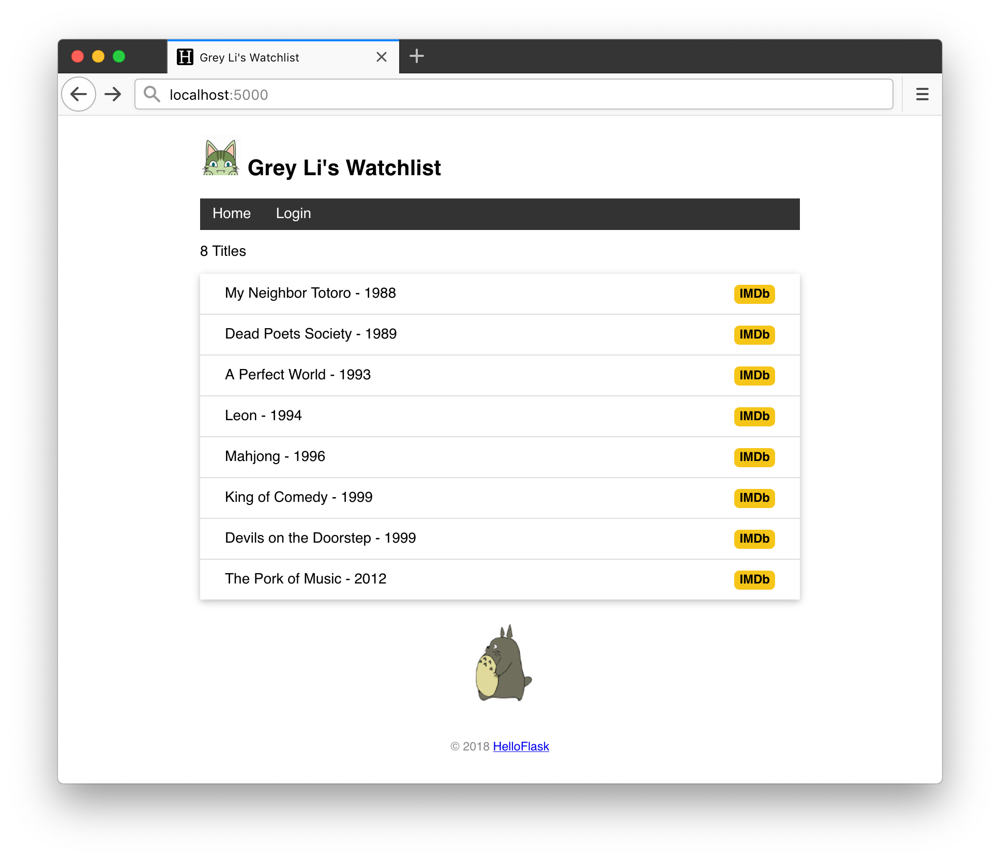
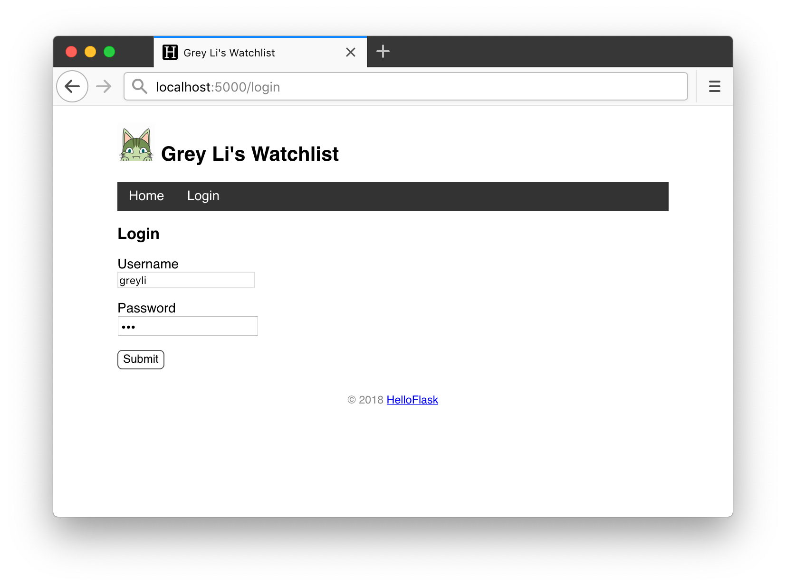
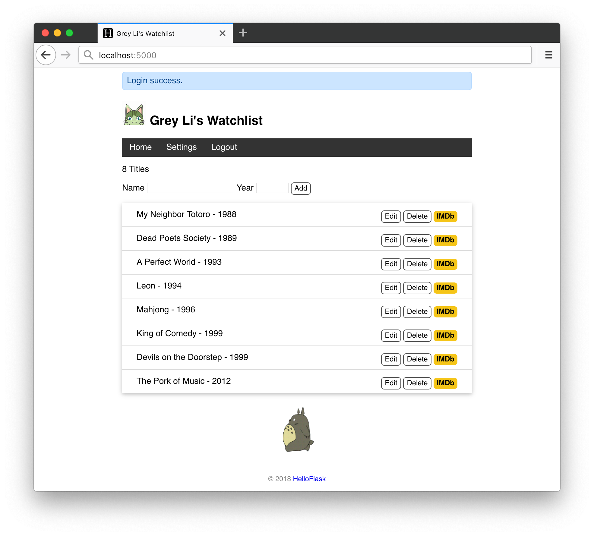

# 第 7 章：用户认证

目前为止，虽然程序的功能大部分已经实现，但还缺少一个非常重要的部分——用户认证保护。页面上的编辑和删除按钮是公开的，所有人都可以看到。假如我们现在把程序部署到网络上，那么任何人都可以执行编辑和删除条目的操作，这显然是不合理的。

这一章我们会为程序添加用户认证功能，这会把用户分成两类，一类是管理员，通过用户名和密码登入程序，可以执行数据相关的操作；另一个是访客，只能浏览页面。在此之前，我们先来看看密码应该如何安全的存储到数据库中。

## 安全存储密码

把密码明文存储在数据库中是极其危险的，假如攻击者窃取了你的数据库，那么用户的账号和密码就会被直接泄露。更保险的方式是对每个密码进行计算生成独一无二的密码散列值，这样即使攻击者拿到了散列值，也几乎无法逆向获取到密码。

Flask 的依赖 Werkzeug 内置了用于生成和验证密码散列值的函数，`werkzeug.security.generate_password_hash()` 用来为给定的密码生成密码散列值，而 `werkzeug.security.check_password_hash()` 则用来检查给定的散列值和密码是否对应。使用示例如下所示：

```python
>>> from werkzeug.security import generate_password_hash, check_password_hash
>>> pw_hash = generate_password_hash('dog')  # 为密码 dog 生成密码散列值
>>> pw_hash  # 查看密码散列值
'pbkdf2:sha256:50000$mm9UPTRI$ee68ebc71434a4405a28d34ae3f170757fb424663dc0ca15198cb881edc0978f'
>>> check_password_hash(pw_hash, 'dog')  # 检查散列值是否对应密码 dog
True
>>> check_password_hash(pw_hash, 'cat')  # 检查散列值是否对应密码 cat
False
```

我们在存储用户信息的 `User` 模型类添加 `username` 字段和 `password_hash` 字段，分别用来存储登录所需的用户名和密码散列值，同时添加两个方法来实现设置密码和验证密码的功能：

```python
from werkzeug.security import generate_password_hash, check_password_hash

class User(db.Model):
    id = db.Column(db.Integer, primary_key=True)
    name = db.Column(db.String(20))
    username = db.Column(db.String(20))  # 用户名
    password_hash = db.Column(db.String(128))  # 密码散列值

    def set_password(self, password):  # 用来设置密码的方法，接受密码作为参数
        self.password_hash = generate_password_hash(password)  # 将生成的密码保持到对应字段

    def validate_password(self, password):  # 用于验证密码的方法，接受密码作为参数
        return check_password_hash(self.password_hash, password)  # 返回布尔值
```

因为模型（表结构）发生变化，我们需要重新生成数据库（这会清空数据）：

```bash
(env) $ flask initdb --drop
```

## 生成管理员账户

因为程序只允许一个人使用，没有必要编写一个注册页面。我们可以编写一个命令来创建管理员账户，下面是实现这个功能的 `admin()` 函数：

```python
import click

@app.cli.command()
@click.option('--username', prompt=True, help='The username used to login.')
@click.option('--password', prompt=True, hide_input=True, confirmation_prompt=True, help='The password used to login.')
def admin(username, password):
    """Create user."""
    db.create_all()

    user = User.query.first()
    if user is not None:
        click.echo('Updating user...')
        user.username = username
        user.set_password(password)  # 设置密码
    else:
        click.echo('Creating user...')
        user = User(username=username, name='Admin')
        user.set_password(password)  # 设置密码
        db.session.add(user)

    db.session.commit()  # 提交数据库会话
    click.echo('Done.')
```

使用 `click.option()` 装饰器设置的两个选项分别用来接受输入用户名和密码。执行 `flask admin` 命令，输入用户名和密码后，即可创建管理员账户。如果执行这个命令时账户已存在，则更新相关信息：

```bash
(env) $ flask admin
Username: greyli
Password: 123  # hide_input=True 会让密码输入隐藏
Repeat for confirmation: 123  # confirmation_prompt=True 会要求二次确认输入
Updating user...
Done.
```

## 使用 Flask-Login 实现用户认证

扩展 [Flask-Login](https://github.com/maxcountryman/flask-login) 提供了实现用户认证需要的各类功能函数，我们将使用它来实现程序的用户认证，首先来安装它：

```bash
(env) $ pip install flask-login
```

这个扩展的初始化步骤稍微有些不同，除了实例化扩展类之外，我们还要实现一个“用户加载回调函数”，具体代码如下所示：

*app.py：初始化 Flask-Login*

```python
from flask_login import LoginManager

login_manager = LoginManager(app)  # 实例化扩展类

@login_manager.user_loader
def load_user(user_id):  # 创建用户加载回调函数，接受用户 ID 作为参数
    user = User.query.get(int(user_id))  # 用 ID 作为 User 模型的主键查询对应的用户
    return user  # 返回用户对象
```

Flask-Login 提供了一个 `current_user` 变量，注册这个函数的目的是，当程序运行后，如果用户已登录， `current_user` 变量的值会是当前用户的用户模型类记录。

另一个步骤是让存储用户的 User 模型类继承 Flask-Login 提供的 `UserMixin` 类：

```python
from flask_login import UserMixin

class User(db.Model, UserMixin):
    # ...
```

继承这个类会让 `User` 类拥有几个用于判断认证状态的属性和方法，其中最常用的是 `is_authenticated` 属性：如果当前用户已经登录，那么 `current_user.is_authenticated` 会返回 `True`， 否则返回 `False`。有了  `current_user` 变量和这几个验证方法和属性，我们可以很轻松的判断当前用户的认证状态。

## 登录

登录用户使用 Flask-Login 提供的 `login_user()` 函数实现，需要传入用户模型类对象作为参数。下面是用于显示登录页面和处理登录表单提交请求的视图函数：

*app.py：用户登录* 

```python
from flask_login import login_user

# ...

@app.route('/login', methods=['GET', 'POST'])
def login():
    if request.method == 'POST':
        username = request.form['username']
        password = request.form['password']

        if not username or not password:
            flash('Invalid input.')
            return redirect(url_for('login'))
        
        user = User.query.first()
        # 验证用户名和密码是否一致
        if username == user.username and user.validate_password(password):
            login_user(user)  # 登入用户
            flash('Login success.')
            return redirect(url_for('index'))  # 重定向到主页

        flash('Invalid username or password.')  # 如果验证失败，显示错误消息
        return redirect(url_for('login'))  # 重定向回登录页面
    
    return render_template('login.html')
```

下面是包含登录表单的登录页面模板：

*templates/login.html：登录页面*

```jinja2



<h3>Login</h3>
<form method="post">
    Username<br>
    <input type="text" name="username" required><br><br>
    Password<br>
    <!-- 密码输入框的 type 属性使用 password，会将输入值显示为圆点 -->
    <input type="password" name="password" required><br><br>
    <input class="btn" type="submit" name="submit" value="Submit">
</form>

```

## 登出

和登录相对，登出操作则需要调用 `logout_user()` 函数，使用下面的视图函数实现：

```python
from flask_login import login_required, logout_user

# ...

@app.route('/logout')
@login_required  # 用于视图保护，后面会详细介绍
def logout():
    logout_user()  # 登出用户
    flash('Goodbye.')
    return redirect(url_for('index'))  # 重定向回首页
```

实现了登录和登出后，我们先来看看认证保护，最后再把对应这两个视图函数的登录/登出链接放到导航栏上。

## 认证保护

在 Web 程序中，有些页面或 URL 不允许未登录的用户访问，而页面上有些内容则需要对未登陆的用户隐藏，这就是认证保护。

### 视图保护

在视图保护层面来说，未登录用户不能执行下面的操作：

* 访问编辑页面
* 访问设置页面
* 执行注销操作
* 执行删除操作
* 执行添加新条目操作

对于不允许未登录用户访问的视图，只需要为视图函数附加一个 `login_required` 装饰器就可以将未登录用户拒之门外。以删除条目视图为例：

```python
@app.route('/movie/delete/<int:movie_id>', methods=['POST'])
@login_required  # 登录保护
def delete(movie_id):
    movie = Movie.query.get_or_404(movie_id)
    db.session.delete(movie)
    db.session.commit()
    flash('Item deleted.')
    return redirect(url_for('index'))
```

添加了这个装饰器后，如果未登录的用户访问对应的 URL，Flask-Login 会把用户重定向到登录页面，并显示一个错误提示。为了让这个重定向操作正确执行，我们还需要把 `login_manager.login_view` 的值设为我们程序的登录视图端点（函数名），把下面这一行代码放到 `login_manager` 实例定义下面即可：

```python
login_manager.login_view = 'login'
```

> **提示** 如果你需要的话，可以通过设置 `login_manager.login_message` 来自定义错误提示消息。

编辑视图同样需要附加这个装饰器：

```python
@app.route('/movie/edit/<int:movie_id>', methods=['GET', 'POST'])
@login_required
def edit(movie_id):
    # ...
```

创建新条目的操作稍微有些不同，因为对应的视图同时处理显示页面的 GET 请求和创建新条目的 POST 请求，我们仅需要禁止未登录用户创建新条目，因此不能使用 `login_required`，而是在函数内部的 POST 请求处理代码前进行过滤：

```python
from flask_login import login_required, current_user

# ...

@app.route('/', methods=['GET', 'POST'])
def index():
    if request.method == 'POST':
        if not current_user.is_authenticated:  # 如果当前用户未认证
            return redirect(url_for('index'))  # 重定向到主页
        # ...
```

最后，我们为程序添加一个设置页面，支持修改用户的名字：

*app.py：支持设置用户名字*

```python
from flask_login import login_required, current_user

# ...

@app.route('/settings', methods=['GET', 'POST'])
@login_required
def settings():
    if request.method == 'POST':
        name = request.form['name']
        
        if not name or len(name) > 20:
            flash('Invalid input.')
            return redirect(url_for('settings'))
        
        current_user.name = name
        # current_user 会返回当前登录用户的数据库记录对象
        # 等同于下面的用法
        # user = User.query.first()
        # user.name = name
        db.session.commit()
        flash('Settings updated.')
        return redirect(url_for('index'))
    
    return render_template('settings.html')
```

下面是对应的模板：

*templates/settings.html：设置页面模板*

```jinja2



<h3>Settings</h3>
<form method="post">
    Your Name <input type="text" name="name" autocomplete="off" required value="{{ current_user.name }}">
    <input class="btn" type="submit" name="submit" value="Save">
</form>

```

### 模板内容保护

认证保护的另一形式是页面模板内容的保护。比如，不能对未登录用户显示下列内容：

- 创建新条目表单
- 编辑按钮
- 删除按钮

这几个元素的定义都在首页模板（index.html）中，以创建新条目表单为例，我们在表单外部添加一个 `if` 判断：

```jinja2
<!-- 在模板中可以直接使用 current_user 变量 -->

<form method="post">
    Name <input type="text" name="title" autocomplete="off" required>
    Year <input type="text" name="year" autocomplete="off" required>
    <input class="btn" type="submit" name="submit" value="Add">
</form>

```

在模板渲染时，会先判断当前用户的登录状态（`current_user.is_authenticated`）。如果用户没有登录（`current_user.is_authenticated` 返回 `False`），就不会渲染表单部分的 HTML 代码，即上面代码块中 `` 和  `` 之间的代码。类似的还有编辑和删除按钮：

```jinja2

	<a class="btn" href="{{ url_for('edit', movie_id=movie.id) }}">Edit</a>
	<form class="inline-form" method="post" action="{{ url_for('.delete', movie_id=movie.id) }}">
		<input class="btn" type="submit" name="delete" value="Delete" onclick="return confirm('Are you sure?')">
	</form>

```

有些地方则需要根据登录状态分别显示不同的内容，比如基模板（base.html）中的导航栏。如果用户已经登录，就显示设置和登出链接，否则显示登录链接：

```jinja2

	<li><a href="{{ url_for('settings') }}">Settings</a></li>
	<li><a href="{{ url_for('logout') }}">Logout</a></li>

	<li><a href="{{ url_for('login') }}">Login</a></li>

```

现在的程序中，未登录用户看到的主页如下所示：



在登录页面，输入用户名和密码登入：



登录后看到的主页如下所示：



