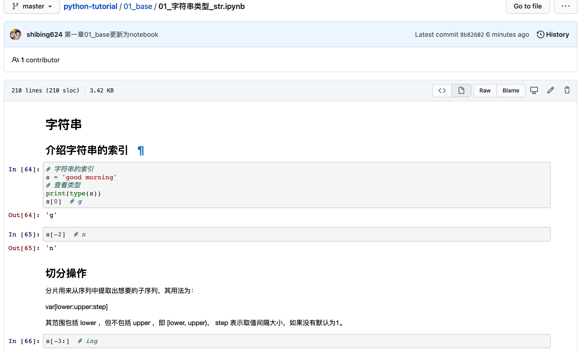

[](requirements.txt)
[](LICENSE)
[](https://github.com/shibing624/python-tutorial/issues)
[](#Contact)

# python-tutorial
Python实用教程，包括：Python基础，Python高级特性，面向对象编程，多线程，数据库，数据科学，Flask，爬虫开发教程。


在本Python教程包含了一些范例，涵盖了大多数Python日常脚本任务，是入门Python的学习资料，也可以作为工作中编写Python脚本的参考实现。
以下所有实现均在python3环境下测试。


**Guide**

- [Tutorial](#python-tutorial的例子清单)
- [Get Started](#get-started)
- [Contact](#Contact)
- [Cite](#Cite)
- [Reference](#reference)


# python-tutorial的例子清单
- 目录说明

| **目录**  | **主题**            | 简要说明                              |
| --------------------- | -------------------------------------------- | ---------------------------- |
| [01_base](01_base)       | Python基础    | 提供了数据类型、字符串、list、条件判断、循环、函数、文件、多进程的使用例子。 |
| [02_advanced](02_advanced)       | Python高级特性    | 提供了数据库、高阶函数、迭代器、面向对象编程的使用例子。 |
| [03_data_science](03_data_science)    | 数据科学 | 提供了常用数据科学库（numpy、scipy、scikit-learn、pandas）的使用例子。 |
| [04_flask](04_flask)      | Flask开发    | 提供了Web框架Flask的使用例子。 |
| [05_spider](05_spider) | 爬虫    | 提供了网络爬虫的实现例子。|
| [06_tool](06_tool) | 实用工具    | 提供了常用的实用工具，包括参数解析、日志工具等例子。|

- Notebook教程说明

| Notebook     |      Description      |   |
|:----------|:-------------|------:|
| [01_base/01_字符串类型_str.ipynb](https://github.com/shibing624/python-tutorial/blob/master/01_base/01_字符串类型_str.ipynb)  | Python字符串类型  |[](https://colab.research.google.com/github/shibing624/python-tutorial/blob/master/01_base/01_字符串类型_str.ipynb) |
| [01_base/02_列表类型_list.ipynb](https://github.com/shibing624/python-tutorial/blob/master/01_base/02_列表类型_list.ipynb)  | Python列表类型  |[](https://colab.research.google.com/github/shibing624/python-tutorial/blob/master/01_base/02_列表类型_list.ipynb) |
| [01_base/03_元组类型_tuple.ipynb](https://github.com/shibing624/python-tutorial/blob/master/01_base/03_元组类型_tuple.ipynb)  | Python元组  |[](https://colab.research.google.com/github/shibing624/python-tutorial/blob/master/01_base/03_元组类型_tuple.ipynb) |
| [01_base/04_字典类型_dict.ipynb](https://github.com/shibing624/python-tutorial/blob/master/01_base/04_字典类型_dict.ipynb)  | Python字典  |[](https://colab.research.google.com/github/shibing624/python-tutorial/blob/master/01_base/04_字典类型_dict.ipynb) |
| [01_base/05_集合类型_set.ipynb](https://github.com/shibing624/python-tutorial/blob/master/01_base/05_集合类型_set.ipynb)  | Python集合  |[](https://colab.research.google.com/github/shibing624/python-tutorial/blob/master/01_base/05_集合类型_set.ipynb) |
| [01_base/06_条件判断_if.ipynb](https://github.com/shibing624/python-tutorial/blob/master/01_base/06_条件判断_if.ipynb)  | Python条件判断  |[](https://colab.research.google.com/github/shibing624/python-tutorial/blob/master/01_base/06_条件判断_if.ipynb) |
| [01_base/07_列表推导式.ipynb](https://github.com/shibing624/python-tutorial/blob/master/01_base/07_列表推导式.ipynb)  | Python列表推导式  |[](https://colab.research.google.com/github/shibing624/python-tutorial/blob/master/01_base/07_列表推导式.ipynb) |
| [01_base/08_循环结构_loop.ipynb](https://github.com/shibing624/python-tutorial/blob/master/01_base/08_循环结构_loop.ipynb)  | Python循环  |[](https://colab.research.google.com/github/shibing624/python-tutorial/blob/master/01_base/08_循环结构_loop.ipynb) |
| [01_base/09_函数和模块.ipynb](https://github.com/shibing624/python-tutorial/blob/master/01_base/09_函数和模块.ipynb)  | Python函数  |[](https://colab.research.google.com/github/shibing624/python-tutorial/blob/master/01_base/09_函数和模块.ipynb) |
| [01_base/10_文件和异常.ipynb](https://github.com/shibing624/python-tutorial/blob/master/01_base/10_文件和异常.ipynb)  | Python文件和异常  |[](https://colab.research.google.com/github/shibing624/python-tutorial/blob/master/01_base/10_文件和异常.ipynb) |
| [01_base/11_线程和进程.ipynb](https://github.com/shibing624/python-tutorial/blob/master/01_base/11_线程和进程.ipynb)  | Python多线程和多进程  |[](https://colab.research.google.com/github/shibing624/python-tutorial/blob/master/01_base/11_线程和进程.ipynb) |
| [02_advanced/01_系统交互_os.ipynb](https://github.com/shibing624/python-tutorial/blob/master/02_advanced/01_系统交互_os.ipynb)  | Python系统交互操作  |[](https://colab.research.google.com/github/shibing624/python-tutorial/blob/master/02_advanced/01_系统交互_os.ipynb) |
| [02_advanced/02_数据库_sql.ipynb](https://github.com/shibing624/python-tutorial/blob/master/02_advanced/02_数据库_sql.ipynb)  | Python操作mysql数据库  |[](https://colab.research.google.com/github/shibing624/python-tutorial/blob/master/02_advanced/02_数据库_sql.ipynb) |
| [02_advanced/03_高阶函数.ipynb](https://github.com/shibing624/python-tutorial/blob/master/02_advanced/03_高阶函数.ipynb)  | map、filter、lambda高阶函数  |[](https://colab.research.google.com/github/shibing624/python-tutorial/blob/master/02_advanced/03_高阶函数.ipynb) |
| [02_advanced/04_迭代器与生成器.ipynb](https://github.com/shibing624/python-tutorial/blob/master/02_advanced/04_迭代器与生成器.ipynb)  | 迭代器和yield生成器  |[](https://colab.research.google.com/github/shibing624/python-tutorial/blob/master/02_advanced/04_迭代器与生成器.ipynb) |
| [02_advanced/05_上下文管理器.ipynb](https://github.com/shibing624/python-tutorial/blob/master/02_advanced/05_上下文管理器.ipynb)  | with语句  |[](https://colab.research.google.com/github/shibing624/python-tutorial/blob/master/02_advanced/05_上下文管理器.ipynb) |
| [02_advanced/06_装饰器.ipynb](https://github.com/shibing624/python-tutorial/blob/master/02_advanced/06_装饰器.ipynb)  | Decorator装饰器  |[](https://colab.research.google.com/github/shibing624/python-tutorial/blob/master/02_advanced/06_装饰器.ipynb) |
| [02_advanced/07_面向对象编程.ipynb](https://github.com/shibing624/python-tutorial/blob/master/02_advanced/07_面向对象编程.ipynb)  | Python类  |[](https://colab.research.google.com/github/shibing624/python-tutorial/blob/master/02_advanced/07_面向对象编程.ipynb) |
| [03_data_science/01_Numpy数组.ipynb](https://github.com/shibing624/python-tutorial/blob/master/03_data_science/01_Numpy数组.ipynb)  | Numpy array数组  |[](https://colab.research.google.com/github/shibing624/python-tutorial/blob/master/03_data_science/01_Numpy数组.ipynb) |
| [03_data_science/02_Numpy索引.ipynb](https://github.com/shibing624/python-tutorial/blob/master/03_data_science/02_Numpy索引.ipynb)  | Numpy index索引  |[](https://colab.research.google.com/github/shibing624/python-tutorial/blob/master/03_data_science/02_Numpy索引.ipynb) |
| [03_data_science/03_Numpy方法.ipynb](https://github.com/shibing624/python-tutorial/blob/master/03_data_science/03_Numpy方法.ipynb)  | Numpy 方法  |[](https://colab.research.google.com/github/shibing624/python-tutorial/blob/master/03_data_science/03_Numpy方法.ipynb) |
| [03_data_science/04_Matpoltlib画图.ipynb](https://github.com/shibing624/python-tutorial/blob/master/03_data_science/04_Matpoltlib画图.ipynb)  | Matpoltlib画图  |[](https://colab.research.google.com/github/shibing624/python-tutorial/blob/master/03_data_science/04_Matpoltlib画图.ipynb) |
| [03_data_science/05_SciPy统计分布.ipynb](https://github.com/shibing624/python-tutorial/blob/master/03_data_science/05_SciPy统计分布.ipynb)  | Scipy统计分布  |[](https://colab.research.google.com/github/shibing624/python-tutorial/blob/master/03_data_science/05_SciPy统计分布.ipynb) |
| [03_data_science/06_SciPy曲线拟合.ipynb](https://github.com/shibing624/python-tutorial/blob/master/03_data_science/06_SciPy曲线拟合.ipynb)  | Scipy曲线  |[](https://colab.research.google.com/github/shibing624/python-tutorial/blob/master/03_data_science/06_SciPy曲线拟合.ipynb) |
| [03_data_science/07_Pandas数据类型.ipynb](https://github.com/shibing624/python-tutorial/blob/master/03_data_science/07_Pandas数据类型.ipynb)  | Pandas数据类型  |[](https://colab.research.google.com/github/shibing624/python-tutorial/blob/master/03_data_science/07_Pandas数据类型.ipynb) |
| [03_data_science/08_Pandas数据操作.ipynb](https://github.com/shibing624/python-tutorial/blob/master/03_data_science/08_Pandas数据操作.ipynb)  | Pandas操作  |[](https://colab.research.google.com/github/shibing624/python-tutorial/blob/master/03_data_science/08_Pandas数据操作.ipynb) |
| [03_data_science/09_Scikit-Learn分类.ipynb](https://github.com/shibing624/python-tutorial/blob/master/03_data_science/09_Scikit-Learn分类.ipynb)  | Scikit-Learn数据分类  |[](https://colab.research.google.com/github/shibing624/python-tutorial/blob/master/03_data_science/09_Scikit-Learn分类.ipynb) |
| [03_data_science/10_Scikit-Learn聚类.ipynb](https://github.com/shibing624/python-tutorial/blob/master/03_data_science/10_Scikit-Learn聚类.ipynb)  | Scikit-Learn聚类  |[](https://colab.research.google.com/github/shibing624/python-tutorial/blob/master/03_data_science/10_Scikit-Learn聚类.ipynb) |
| [04_flask/01_Flask介绍.md](https://github.com/shibing624/python-tutorial/blob/master/04_flask/01_Flask介绍.md)  | Flask介绍 | |
| [04_flask/02_Flask模板.md](https://github.com/shibing624/python-tutorial/blob/master/04_flask/02_Flask模板.md)  | Flask模板 | |
| [04_flask/03_静态文件.md](https://github.com/shibing624/python-tutorial/blob/master/04_flask/03_静态文件.md)  | Flask静态文件 | |
| [04_flask/04_数据库.md](https://github.com/shibing624/python-tutorial/blob/master/04_flask/04_数据库.md)  | Flask数据库 | |
| [04_flask/05_模板优化.md](https://github.com/shibing624/python-tutorial/blob/master/04_flask/05_模板优化.md)  | Flask模板优化 | |
| [04_flask/06_表单.md](https://github.com/shibing624/python-tutorial/blob/master/04_flask/06_表单.md)  | Flask表单 | |
| [04_flask/07_用户认证.md](https://github.com/shibing624/python-tutorial/blob/master/04_flask/07_用户认证.md)  | 用户认证 | |
| [04_flask/08_Flask应用watchlist](https://github.com/shibing624/python-tutorial/blob/master/04_flask/watchlist)  | Flask应用示例watchlist | |
| [05_spider/01_爬虫介绍.ipynb](https://github.com/shibing624/python-tutorial/blob/master/05_spider/01_爬虫介绍.ipynb)  | Python网络爬虫介绍  |[](https://colab.research.google.com/github/shibing624/python-tutorial/blob/master/05_spider/01_爬虫介绍.ipynb) |
| [05_spider/02_网页解析和存储.ipynb](https://github.com/shibing624/python-tutorial/blob/master/05_spider/02_网页解析和存储.ipynb)  | 网页工具requests、lxml、BeautifulSoup、Selenium  |[](https://colab.research.google.com/github/shibing624/python-tutorial/blob/master/05_spider/02_网页解析和存储.ipynb) |
| [06_tool/argparse_demo.py](https://github.com/shibing624/python-tutorial/blob/master/06_tool/argparse_demo.py)  | Python参数解析  | |
| [06_tool/profiler工具.md](https://github.com/shibing624/python-tutorial/blob/master/06_tool/profiler工具.md)  | Python性能监测工具  | |
| [06_tool/logger.py](https://github.com/shibing624/python-tutorial/blob/master/06_tool/logger.py)  | Python日志  | |
| [06_tool/send_email.py](https://github.com/shibing624/python-tutorial/blob/master/06_tool/send_email.py)  | Python发邮件  | |


# Get Started

教程代码大多数为Notebook书写（文件后缀.ipynb），如下所示：


- 使用Colab学习教程：

点击各教程的[](https://colab.research.google.com/github/shibing624/python-tutorial/blob/master/01_base/01_字符串类型_str.ipynb)即可在Google Colab打开Notebook并运行。

- 使用Jupyter Notebook学习教程：

1. 下载Python：建议使用Anaconda，Python环境和包一键装好，[Python3.7 版本](https://www.anaconda.com/products/individual)
2. 下载本项目：可以使用`git clone`，或者下载zip文件，解压到电脑
3. 打开Jupyter Notebook：打开终端，`cd`到本项目所在的文件夹，执行：```jupyter notebook ```，浏览器打开`01_base/01_字符串类型.ipynb`，跟随介绍交互使用

# Contact

- Issue(建议)：[](https://github.com/shibing624/python-tutorial/issues)
- 邮件我：xuming: xuming624@qq.com
- 微信我：加我*微信号：xuming624*，进Python-NLP交流群，备注：*姓名-公司名-NLP*


# Citation

如果你在研究中使用了python-tutorial，请按如下格式引用：

```latex
@misc{python-tutorial,
  title={python-tutorial: Python3 Tutorial for Beginners},
  author={Ming Xu},
  howpublished={https://github.com/shibing624/python-tutorial},
  year={2021}
}
```

# License


授权协议为 [The Apache License 2.0](/LICENSE)，可免费用做商业用途。请在产品说明中附加python-tutorial的链接和授权协议。


# Contribute
项目代码还很粗糙，如果大家对代码有所改进，欢迎提交回本项目，在提交之前，注意以下两点：

 - 在本地进行单元测试
 - 确保所有单测都是通过的

之后即可提交PR。

# Reference

1. [廖雪峰Python3教程](https://www.liaoxuefeng.com/wiki/1016959663602400)
2. [PythonDataScienceHandbook](https://github.com/jakevdp/PythonDataScienceHandbook)
3. [Python4DataScience.CH](https://github.com/catalystfrank/Python4DataScience.CH)
4. [Python-100-Days](https://github.com/jackfrued/Python-100-Days)
5. [flask-tutorial](https://github.com/greyli/flask-tutorial)
